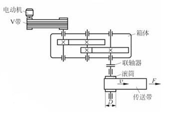

# 机械设计课程作业-减速箱

本仓库提供一个开源的机械设计课程作业可供参考。适用于全国广大高等院校机械专业的机械设计课程。需注意：**本仓库设计内容为二级展开式齿轮减速器（斜齿）**，传动简图：

    

## 初始参数

| 运输带工作拉力 $F$ | 运输带工作速度 $v$ | 滚筒直径 $D$ | 滚筒效率 $\eta_w$ | 
| --- | --- | --- | --- |
| 5250N | 0.85m/s | 410mm | 0.96 |

- 两班制，连续单向运转，载荷平稳；要求传动使用寿命为 10 年。

---

## 设计说明书

请见`设计说明书`文件夹，可直接导入`overleaf`进行编辑，需将`Latex`   编译器更改为`XeLaTeX`进行编译。

---

## 图纸

`装配图.dwg`：

    

`零件图(中间轴).dwg`：

    

---

## Acknowledgement

感谢b站up主天上一白的视频[机械设计课程设计/减速器设计—全流程详解](https://www.bilibili.com/video/BV1A44y197Hb/?vd_source=a416fcb6c88258170a1902d8753f0269)，帮助我完成了学校老师什么也没讲就布置的作业。看到本仓库的同学也可以去跟着学习一下。

参考书目：
- [《机械设计教程——理论、方法与标准（第2版）》-清华大学出版社](https://detail.tmall.com/item.htm?id=743610688816&ns=1&abbucket=9&xxc=taobaoSearch&mi_id=0000jN5BtbTky5EM8lY6keKkruvAgI7Hbh4QIGRU6z9Qj4o&skuId=null&utparam=%7B%22aplus_abtest%22%3A%22fa5aa8c74f1fd78c79f4b482342bda57%22%7D&spm=a21n57.1.hoverItem.1) 巨烂，计算部分全是错的，但是是我们学校老师编的教材，不得不用
- [《机械设计课程设计（第6版）》-机械工业出版社](https://item.taobao.com/item.htm?abbucket=9&id=691022636697&mi_id=00001MmGxXfCJVHxE_dirtARbp7lDC7_1T5hThs0oaZjx7c&ns=1&priceTId=2100c82e17693246957004931e0903&spm=a21n57.1.hoverItem.1&utparam=%7B%22aplus_abtest%22%3A%2247a8211595a3cb157b93924c4ae84e81%22%7D&xxc=taobaoSearch) 推荐将本书作为课程设计的参考，流程、标准都很详细

---

$^*$ 所有内容仅供参考，部分内容有错请详细辨认。

---

## Leave a star if you like it 🥰

 
 

© 2025 Yanhan Sun (Frank).